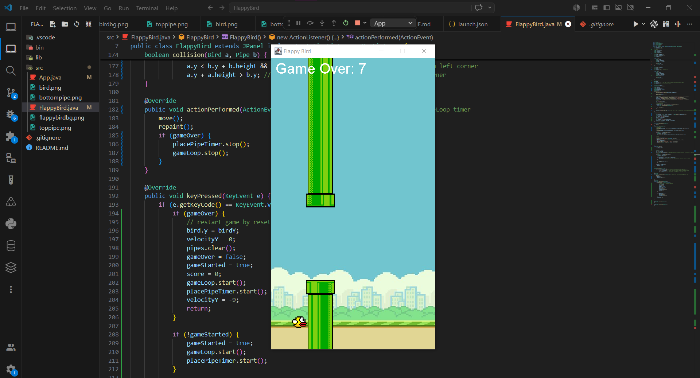

# Flappy Bird Game 🦆
this game is built-in java awt/swing graphics library 

throughtout this project i learned how oop concepts, game loop, work in a real fun project 
as well as creating a jframe and a jpanel, draw images on the jpanel, and click handlers to make the bird jump, adding a running score.

